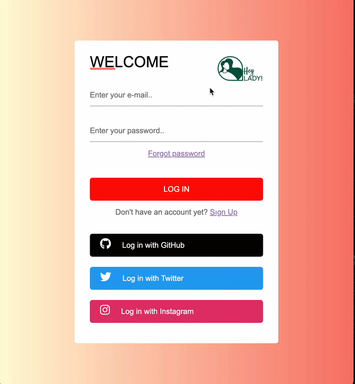

<h1> Login-Register form </h1>

 Kind of basic login-register form for users of an Elt programme. Created with Html and styled with Css using simple tags.It's a really small step for coding path but a big memory for me.. 

# First-step
